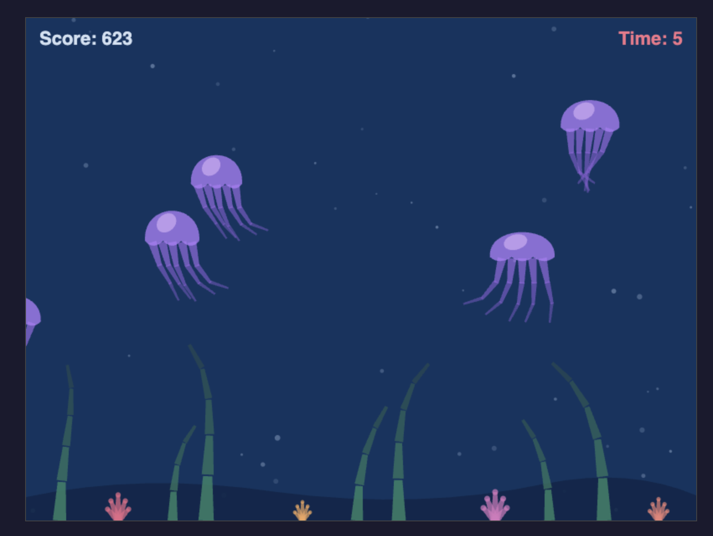
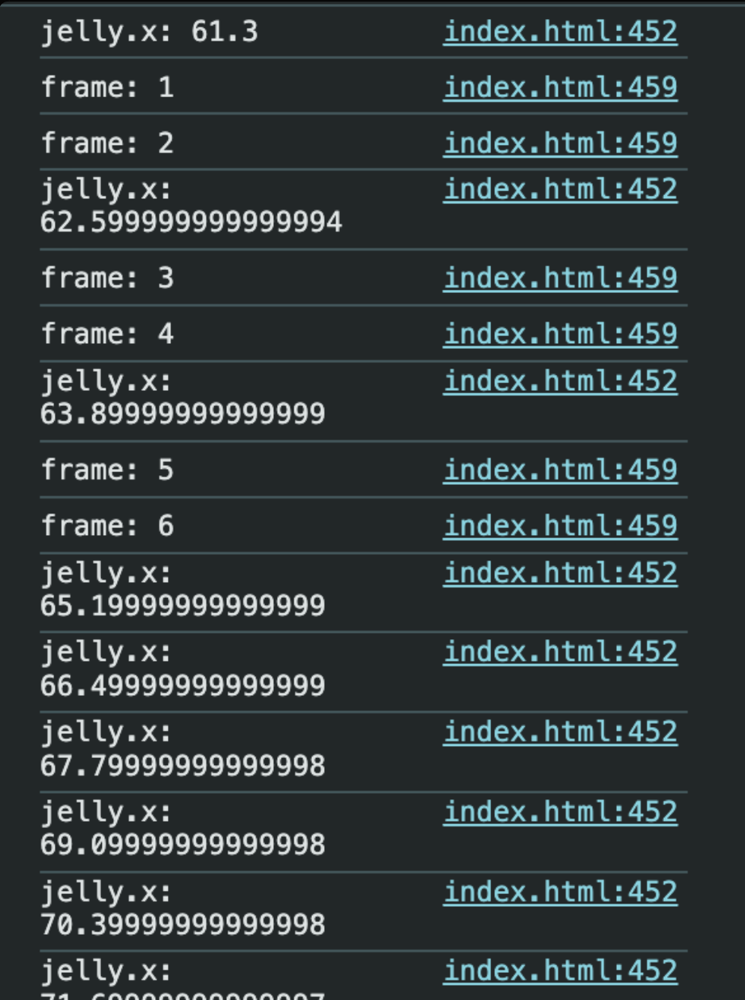
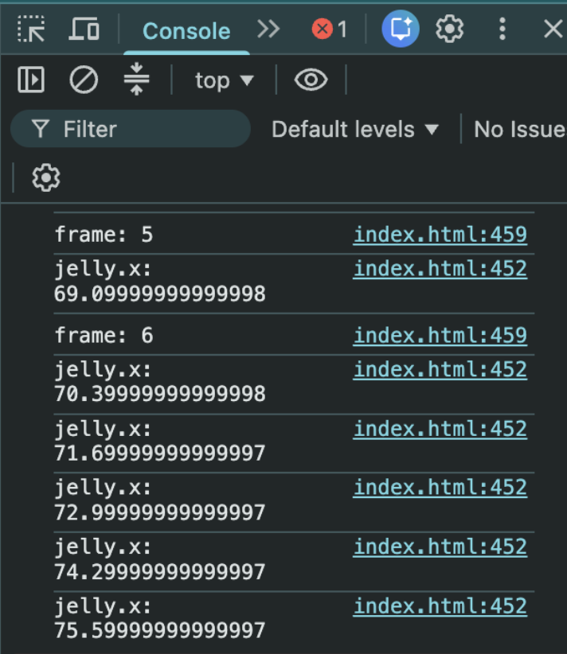
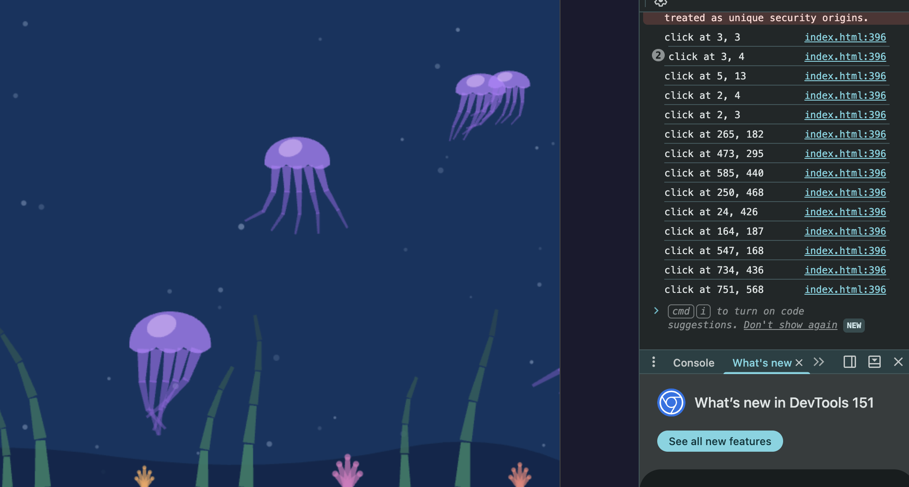
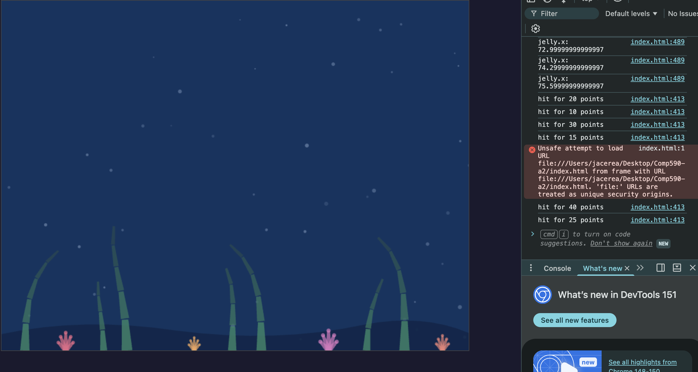
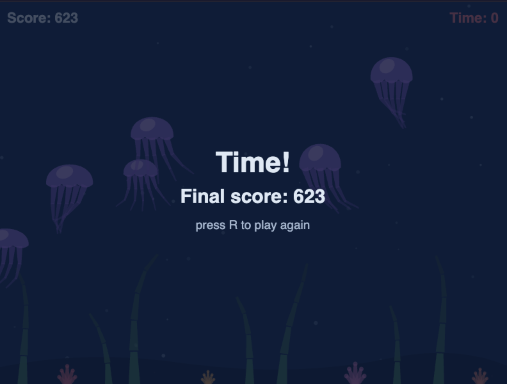

# Jellyfish Gallery

COMP 590: Build Your Own Game Engine (Assignments 2 and 3)

A hierarchical 2D scene on the HTML5 Canvas. No libraries, no build step, no
dependencies, everything is in a single self-contained index.html. Open it in
a browser to run it.



## How to play
- 45 second round
- Click a jellyfish to score, it respawns from the left at a new size and speed
- Smaller jellyfish move faster and pay more
- Press **R** to restart

---

## Assignment 2: the simulation engine

**Scene graph.** Everything on screen is a Node with a position, rotation and
scale relative to its parent, plus a list of children. Drawing one means:
`save()` → transform → draw self → recurse into children → `restore()`. Children
inherit the parent's motion for free.

**The hierarchy:**

```
jellyfish                      seaweed stalk
├── tentacle × 5               └── link
│   └── mid segment                └── link
│       └── tip segment                └── link
└── bell                                   └── link
```

- Each jellyfish has five tentacle children, each a three link chain
- Seaweed stalks run four to five links deep
- Every `save()` is matched by exactly one `restore()`

**Animation.** All joint motion is sine waves sharing one rate per creature,
differing only in phase offset and amplitude.

- Each tentacle segment lags the one above it, so sway travels down the chain
- Seaweed works in reverse, motion starts at the base and travels up
- The bell squashes and stretches so the pulse reads as a muscle, not growth
- Coral is deliberately static, to give the eye a fixed reference

---

## Assignment 3 Update

Quick Note: in the code, you will see what code I have added for assignment 3 that differs from assignment 2.

### Fixed timestep, variable rendering

Assignment 2 ran one update per frame sized to however long that frame took, so
no two runs produced the same numbers. The loop now accumulates real time and
spends it in exact 1/60 second increments:

- `update()` only ever receives `STEP`, never a variable delta
- A slow frame runs several update steps before drawing once
- A fast frame may run zero update steps and just redraw
- The accumulator is capped at 0.25s so a backgrounded tab can't queue thousands
  of pending steps and lock the page (the spiral of death)

Because `update()` never sees anything but `STEP`, every sine wave lands on the
same value at the same tick on every run. The console logs the first jellyfish's
x position for the first twelve ticks to prove it:

```
Run 1                          Run 2
jelly.x: 61.3                  jelly.x: 69.09999999999998
jelly.x: 62.599999999999994    jelly.x: 70.39999999999998
jelly.x: 63.89999999999999     jelly.x: 71.69999999999997
jelly.x: 65.19999999999999     jelly.x: 72.99999999999997
```

Identical positions, different frame boundaries. The trailing digits are
floating point drift from repeated addition, the same digits every run, which
is the point.




### MVC separation

- **Controller**, `mousedown` on the canvas, `keydown` on the window. Both fire
  independently of the game loop
- **Model**, the `game` object (score, time, round state) plus the scene graph.
  Nothing here draws
- **View**, `draw()` and `drawHud()`. These read state and never write it

The round clock ticks on simulation steps, not wall clock, so every round is
exactly the same length regardless of frame rate.

### Hit detection

- `getBoundingClientRect()` converts viewport coordinates into canvas space,
  with a scale factor for when display size differs from canvas resolution
- Circle test against the bell, comparing squared distances to skip the square
  root
- The scene array is walked backwards so overlapping jellyfish resolve to the
  one drawn on top




### Respawning

- Shot jellyfish are recycled, not deleted , the same node returns from the left
  with new random traits
- The scene array never changes length, so no allocation happens during play
- Point values scale inversely with size



---

## Notes

- No external libraries in either assignment.
- Opening the file via `file://` produces a console warning about unique
  security origins. That comes from Chrome's local file handling, not the code,
  and disappears when served over HTTP
